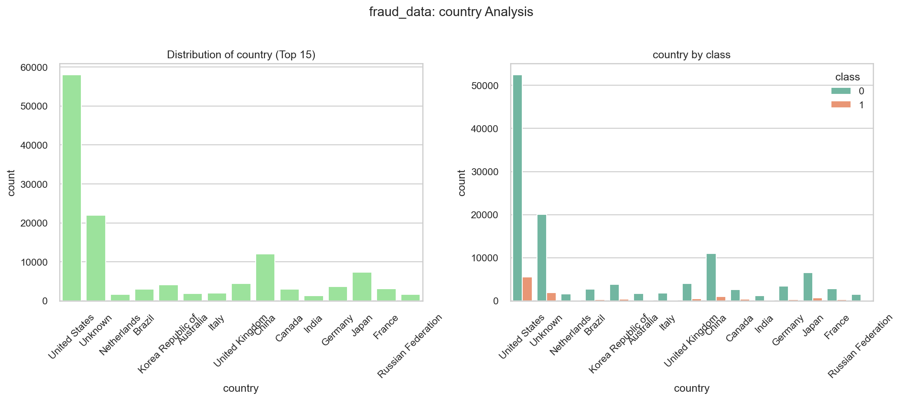
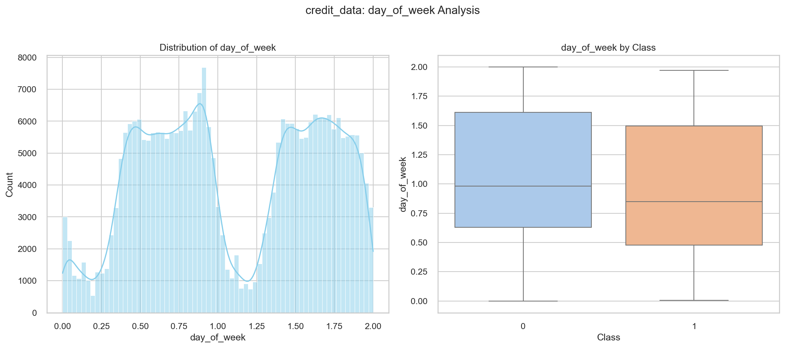

# FraudDetection-for-ecommerce-and-BankTransactions

Improved detection of fraud cases for e-commerce and bank transactions

# Task 1: Data Analysis & Preprocessing

**Adey Innovation Inc.**

## 📌 **Project Overview**

This project focuses on improving fraud detection for e-commerce and banking transactions. Task 1 covers **data analysis, preprocessing, and feature engineering** to prepare datasets for model training.

### 📂 **Dataset Sources**

1. `Fraud_Data.csv`: E-commerce transactions (user behavior, device, IP, purchase details).
2. `IpAddress_to_Country.csv`: Maps IP ranges to countries.
3. `creditcard.csv`: Bank transactions with anonymized features (V1-V28).

---

## 🛠️ **Task 1 Implementation**

### **1. Data Processing**

**Script**: [`src/data_processing.py`](src/data_processing.py)

- Handles missing values (imputation/dropping).
- Removes duplicates and corrects data types (e.g., datetime conversion).

### **2. Exploratory Data Analysis (EDA)**

**Script**: [`src/eda.py`](src/eda.py) | **Notebook**: [`notebooks/plots/`](notebooks/plots/)

- **Univariate Analysis**: Class imbalance, transaction value distributions.
- **Bivariate Analysis**: Fraud vs. time, geolocation, purchase patterns.
- **Sample Outputs**
  - 
  - 

### **3. Feature Engineering**

**Script**: [`src/data_engineering.py`](src/data_engineering.py)

- **Time-Based Features**: `hour_of_day`, `day_of_week`, `time_since_signup`.
- **Behavioral Features**: Transaction frequency/velocity.
- **Geolocation**: Merged IP addresses with country data.

### **4. Data Transformation**

**Notebook**: [`notebooks/data_transformation.ipynb`](notebooks/data_transformation_1.ipynb)

- **Class Imbalance**: Applied SMOTE (oversampling) on training data.
- **Scaling**: Standardized numerical features (`StandardScaler`).
- **Encoding**: One-Hot for categorical variables (`source`, `browser`, `country`).

---

## 📊 **Key Findings**

✅ Fraud rate: **2.5%** (highly imbalanced).  
✅ High-value transactions (>$500) are 5x more likely to be fraudulent.  
✅ Peak fraud times: **8 PM–2 AM**, especially on weekends.

---

## 🚧 **Challenges**

1. **IP-to-Country Merge**: Required integer conversion and interval matching.
2. **Class Imbalance**: SMOTE improved recall but needed careful validation.

---

## 🚀 **Next Steps**

- Proceed to **Task 2 (Model Training & Evaluation)**.
- Focus on optimizing recall to minimize false negatives.

---
